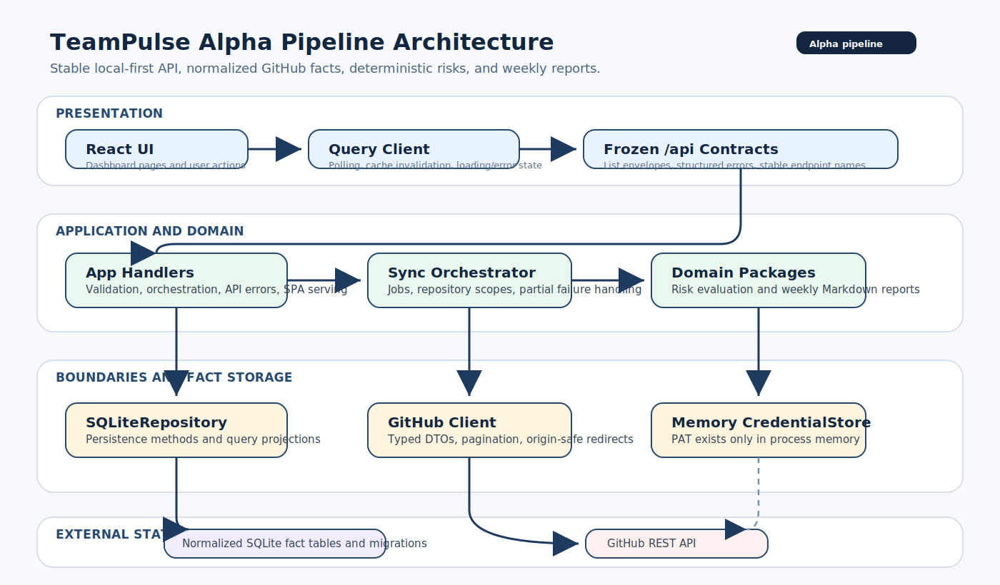

# TeamPulse

TeamPulse is a local-first engineering team insights dashboard for GitHub repositories. It synchronizes repository facts into a local SQLite database, evaluates pull request delivery risks, and generates deterministic weekly Markdown reports.

It is designed to help a team answer a small set of operational questions:

- What changed recently across the selected repositories?
- Which pull requests are blocked by review, stale activity, or current-head CI failures?
- Which repositories and contributors have recent activity?
- What should be communicated in this week's engineering summary?



## Live Screenshots


## Current Scope

The current Alpha scope is intentionally narrow:

- Manual fine-grained GitHub PAT entry
- Memory-only credential storage
- Manual sync for selected repositories
- Server-side repository selection with default 5 and hard limit 20
- GitHub facts for commits, pull requests, PR files, reviews, workflow runs, activity events, and members
- Three risk rules: waiting review, stale pull request, and current-head CI failure
- Fixed weekly Markdown reports
- Local-only HTTP server and embedded React frontend

Out of scope for this Alpha: GitHub OAuth Device Flow, Keychain token storage, scheduled background sync, organization modeling, daily/risk report templates, and cloud upload.

## Core Capabilities

### GitHub Activity Sync

- Uses a fine-grained GitHub personal access token entered in Settings.
- Stores the token only in server process memory; it is cleared on server restart or disconnect.
- Refreshes accessible repositories from GitHub and persists repository identity locally.
- Syncs selected repositories by local repository ID.
- Follows GitHub pagination for repositories, commits, PRs, PR files, reviews, and workflow runs.
- Persists resource-level sync failures and can complete a job as `partial` while retaining successful repository data.

Recommended read-only fine-grained PAT permissions:

| Permission | Access |
| --- | --- |
| Metadata | Read |
| Contents | Read |
| Pull requests | Read |
| Actions | Read |

### Engineering Dashboard

- Overview: setup status, engineering health, recent activity, PR queue, risks, and latest sync state.
- Activity: recent commit, PR, review, and workflow-derived events.
- Pull Requests: PR state, review state, CI state, current head SHA, changed files, and detail API support.
- Team: contributor activity aggregated from synced facts, not cumulative counters.
- Repositories: selected/tracked repositories, health, activity, open PRs, and CI state.
- Risks: grouped open risk signals backed by persisted lifecycle state.
- Reports: fixed weekly Markdown report generated from PR, review, workflow, risk, and repository activity facts.
- Settings: GitHub connection, repository selection/sync, local server status, notifications, and privacy notes.

### Risk Rules

The Alpha risk evaluator supports:

- Waiting for review: open, non-draft PRs waiting beyond the configured threshold.
- Stale pull request: open, non-draft PRs with no effective activity beyond the configured threshold.
- CI failure: current PR head SHA has a failing or timed-out workflow run.

Risk thresholds are stored in SQLite through `GET/PATCH /api/settings`. Risk signals use stable keys and lifecycle events so they can resolve and reopen without losing history.

### Weekly Reports

Weekly reports are generated locally as Markdown with a fixed template:

1. Summary
2. Completed
3. In Progress
4. Reviews
5. CI Health
6. Risks
7. Repository Activity

Reports are stored in the local SQLite database and can be copied or downloaded from the app. They are not uploaded to any cloud service.

## Architecture

```text
React UI
  -> stable /api contracts (list envelopes + structured errors)
  -> app handlers (validation + orchestration)
  -> domain packages (risk evaluation, weekly reports)
  -> SQLiteRepository + GitHub Client + Memory CredentialStore
  -> normalized SQLite fact tables and GitHub API
```

Key boundaries:

| Layer | Responsibility |
| --- | --- |
| `internal/api` | Route registration, local-only middleware, same-origin checks |
| `internal/app` | HTTP handlers, validation, sync orchestration, API errors, SPA serving |
| `internal/credentials` | Memory-only credential store |
| `internal/github` | Typed GitHub REST client, pagination, redirect/origin safety |
| `internal/database` | SQLite opening, embedded migrations, persistence, query projections, reports, risks, settings |
| `internal/risks` | Deterministic risk decisions from persisted PR candidates |
| `internal/reports` | Weekly period calculation and Markdown rendering |
| `migrations` | Immutable SQL migrations embedded into the Go binary |
| `web/src` | React UI, TanStack Query state, API integration |

## Project Structure

```text
.
├── cmd/teampulse/              # Local Go server entry point
├── docs/                       # Alpha contracts, database design, SOPs, architecture diagram
├── internal/api/               # HTTP route wiring and local request guards
├── internal/app/               # App handlers, sync orchestration, embedded SPA
├── internal/credentials/       # Memory credential store
├── internal/database/          # SQLite migrations, repository methods, query projections
├── internal/github/            # GitHub REST client
├── internal/reports/           # Weekly report domain logic
├── internal/risks/             # Risk evaluator domain logic
├── migrations/                 # Embedded SQL migrations
├── scripts/                    # Manual test launcher and repository hygiene checks
├── web/                        # React + Vite frontend
├── desktop/macos/              # SwiftUI menu bar launcher
├── Makefile                    # Build, run, and test targets
└── README.md
```

## Requirements

Required:

- Go 1.22+
- Node.js 20+
- npm
- SQLite support through the Go `modernc.org/sqlite` dependency

Optional:

- Swift 5.9+ / Xcode Command Line Tools for the macOS menu bar app
- `lsof` and `curl` for the isolated manual test launcher

## Quick Start

### 1. Build and Run

```bash
make run
```

The server prints a readiness event similar to:

```json
{"event":"server_ready","url":"http://127.0.0.1:19421"}
```

Open the printed URL.

### 2. Connect GitHub

In Settings, paste a fine-grained PAT with read-only repository access. TeamPulse validates the token with GitHub and stores it only in process memory.

### 3. Select and Sync Repositories

After connection, TeamPulse refreshes the repository catalog. Select repositories in Settings and start sync. The server enforces a maximum of 20 selected repositories.

## Development

### Isolated Manual Test Mode

Use the test launcher for manual regression work without touching production local data:

```bash
./scripts/run-test.sh
```

This starts:

- Backend: `http://127.0.0.1:19421`
- Vite frontend with HMR: `http://127.0.0.1:5174`
- Data directory: `./tmp/manual-test`

For a fresh isolated database:

```bash
./scripts/run-test.sh --fresh
```

The launcher refuses to start if the fixed ports are already in use.

### Backend Only

```bash
make backend
./build/teampulse-server -host 127.0.0.1 -port 19421 -data-dir ./tmp/data
```

The server only accepts `127.0.0.1` as the listen host. If the requested port is occupied, the server searches ports `19421` through `19521`.

### Frontend Only

```bash
cd web
npm install
npm run dev
```

The Vite dev server proxies `/api` to `http://127.0.0.1:19421` and rewrites the request origin for same-origin validation.

### Production Frontend Assets

```bash
cd web
npm run build
```

Build output is written to `internal/app/webdist/` and embedded by the Go server.

## Common Commands

```bash
make web                # Install frontend dependencies and build production frontend assets
make backend            # Compile the Go server only
make server             # Build frontend assets and compile the Go server
make run                # Build and start the local service
make check-repository   # Fail if local DB files are tracked by Git
make test               # Repository check, frontend build, and Go tests
make macos              # Build the server and SwiftUI macOS launcher
make clean              # Remove build output, node_modules, and Swift build caches
```

Frontend unit tests:

```bash
cd web
npm test
```

Go tests:

```bash
go test ./...
```

## Data Storage

By default, TeamPulse stores local data at:

```text
~/Library/Application Support/TeamPulse/
```

Main files and directories:

| Path | Description |
| --- | --- |
| `teampulse.db` | Main SQLite database |
| `run/server.json` | Current server runtime status |
| `run/server.pid` | Current server process ID |
| `backups/` | Legacy database backups |
| `logs/` | Reserved log directory |
| `cache/` | Reserved cache directory |
| `reports/` | Reserved report directory; Alpha report records live in SQLite |

If TeamPulse detects the old prototype schema, it checkpoints the database, backs it up under `backups/`, removes the old DB files, and initializes the migrated Alpha schema. There is no automatic data backfill from the prototype tables.

## Security and Privacy

TeamPulse is designed as a local developer tool:

- The HTTP service binds only to `127.0.0.1`.
- Non-local requests are rejected.
- Mutating requests must pass same-origin validation.
- GitHub PATs are not persisted.
- Raw PR patches are not stored.
- Raw GitHub error bodies are not returned through API errors.
- Data and reports remain local unless the user manually shares them.

## API Overview

List endpoints return:

```json
{"items":[],"next_cursor":null}
```

Errors return:

```json
{"error":{"code":"INVALID_ARGUMENT","message":"...","details":{},"request_id":"..."}}
```

### System

| Method | Endpoint | Description |
| --- | --- | --- |
| `GET` | `/api/health` | Service health and schema version |
| `GET` | `/api/app/status` | Local app status and data directory |
| `POST` | `/api/system/shutdown` | Request local service shutdown |

### GitHub Auth and Repositories

| Method | Endpoint | Description |
| --- | --- | --- |
| `GET` | `/api/github/auth/status` | GitHub authentication status |
| `POST` | `/api/github/auth/token` | Validate and store an in-memory PAT |
| `DELETE` | `/api/github/auth` | Clear the current in-memory token |
| `GET` | `/api/repositories` | Refresh and list persisted repositories |
| `PATCH` | `/api/repositories/selection` | Update selected repositories by local ID |

### Sync and Facts

| Method | Endpoint | Description |
| --- | --- | --- |
| `POST` | `/api/sync-jobs` | Start a manual sync for selected repository IDs |
| `GET` | `/api/sync-jobs` | List recent sync jobs |
| `GET` | `/api/sync-jobs/{id}` | Get a sync job |
| `GET` | `/api/activities` | List activity events |
| `GET` | `/api/members` | List fact-derived member statistics |
| `GET` | `/api/pull-requests` | List PR summaries |
| `GET` | `/api/pull-requests/{id}` | Get PR details, files, reviews, and current-head workflow runs |

### Risks and Settings

| Method | Endpoint | Description |
| --- | --- | --- |
| `GET` | `/api/risks` | List open risk signals |
| `PATCH` | `/api/risks/{id}` | Update risk status |
| `GET` | `/api/settings` | Read risk settings and version |
| `PATCH` | `/api/settings` | Update risk settings with optimistic version |

### Reports

| Method | Endpoint | Description |
| --- | --- | --- |
| `POST` | `/api/reports` | Generate a weekly report |
| `GET` | `/api/reports` | List report history |
| `GET` | `/api/reports/{id}` | Get report metadata and Markdown |
| `GET` | `/api/reports/{id}/download` | Download report Markdown |

## Manual Regression

The manual regression baseline lives in:

```text
docs/page-test-sop.md
```

Run it for phase completion or API/page behavior changes. The SOP uses the isolated test launcher and records known Alpha limitations.

## Current Limitations

- GitHub OAuth Device Flow is not implemented.
- Persistent token storage in macOS Keychain is not implemented.
- Automatic scheduled background sync is not implemented.
- Latest-attempt-per-workflow aggregation for rerun CI scenarios is not complete.
- Alpha reports are fixed weekly Markdown only.
- Existing prototype DB rows are backed up but not backfilled into the new schema.
- Packaged macOS builds must be signed and notarized before distribution.

## License

Licensed under the Apache License, Version 2.0. See [LICENSE](LICENSE).
