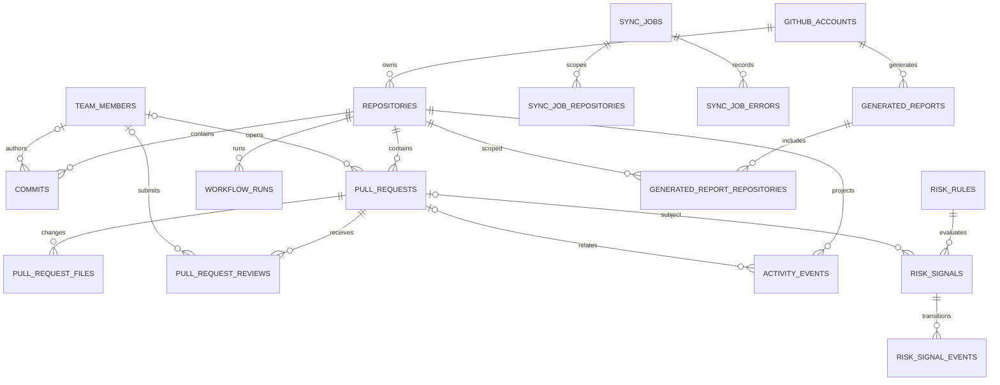

# TeamPulse Alpha Database Design

Status: Alpha 0 frozen draft. Future schema changes may only add migrations. Timestamps are always stored as UTC RFC3339 text. Tokens, Authorization headers, and raw patches are never persisted.

## Core Queries Deduced from the Product

| Page / capability | Required queries | Fact sources |
| --- | --- | --- |
| Overview | Selected repository count; active members, commits, and reviews within the time range; open PRs; open risks; recent activity; last sync time | `repositories`, `commits`, `pull_request_reviews`, `pull_requests`, `risk_signals`, `activity_events`, `sync_jobs` |
| Activity | Query by repository, member, type, and descending time order, with links to GitHub | `activity_events` JOIN repository/member/PR |
| Pull Requests | List PRs by state and updated time; review state uses each reviewer's latest effective review; CI only uses the latest attempt for each workflow on the current `head_sha` | `pull_requests`, `pull_request_reviews`, `workflow_runs`, `pull_request_files` |
| Risks | Query by status, severity, and detected time; when conditions disappear, update the same `signal_key` to Resolved | `risk_rules`, `risk_signals`, and PR/review/workflow fact tables |
| Reports | Merged PRs in the interval, active PRs that remain open, effective reviews, current-head CI, open risks at period end, repository activity, and GitHub links | All fact tables; does not depend on `metadata_json` or cumulative counters |

Member statistics are always aggregated from fact tables at query time. `activity_events` is an idempotent timeline projection, not the sole fact source for commits, reviews, PRs, or CI.

## Simplified ER Diagram

`workflow_runs` is not directly cached as PR state. At query time, it must satisfy both `workflow_runs.repository_id = pull_requests.repository_id` and `workflow_runs.head_sha = pull_requests.head_sha`, then select the latest run for the current head by `(workflow_id, run_number, run_attempt)`. After a force push, runs from old SHAs naturally drop out of the current PR CI calculation.

## Core Data Dictionary

| Table | Primary key and stable identity | Key fields and constraints |
| --- | --- | --- |
| `github_accounts` | Local `id`; `github_id` UNIQUE | Stores only GitHub identity and connection state, not credentials |
| `repositories` | Local `id`; `github_id` UNIQUE | `(account_id, full_name)` UNIQUE; selection, visibility, sync status, and name overwritten after rename |
| `team_members` | Local `id`; `github_id` UNIQUE when a GitHub user exists | `login` is a mutable display field, not an identity key; unmapped Git authors remain only in fact-table snapshot fields |
| `commits` | Local `id`; `(repository_id, sha)` UNIQUE | Commits have no numeric GitHub ID; SHA is the immutable stable key; stores message, link, author, and commit time |
| `pull_requests` | Local `id`; `github_id` UNIQUE; `(repository_id, number)` UNIQUE | Current `head_sha`, change statistics, file completeness, review request/author/latest activity time, and GitHub timestamps |
| `pull_request_files` | Local `id`; `(pull_request_id, filename)` UNIQUE | Added/deleted lines and type classification; raw patches are not stored |
| `pull_request_reviews` | Local `id`; `github_id` UNIQUE | Reviewer, review state, `commit_sha`, submitted/dismissed time; approvals only apply to the applicable head |
| `workflow_runs` | Local `id`; `github_id` UNIQUE | `workflow_id`, `head_sha`, run number/attempt, status/conclusion, and GitHub timestamps |
| `activity_events` | Local `id`; `(event_type, source_type, source_id, occurred_at)` UNIQUE | Filterable timeline; key business decisions must not depend only on `metadata_json` |
| `sync_jobs` | UUID text `id` | Stable status enum, stage, progress, summarized errors; repository/resource errors go into child tables |
| `risk_rules` | `rule_type` | Enabled flag, severity, and threshold configuration |
| `risk_signals` | UUID text `id`; `signal_key` UNIQUE | `(rule_type, repository_id, subject_type, subject_id)` UNIQUE; lifecycle and evidence snapshot |
| `risk_signal_events` | Local `id`; `(risk_signal_id, occurrence_number, event_type)` UNIQUE | Records each Open/Resolve transition so status at the end of a past interval can be reconstructed |
| `generated_reports` | UUID text `id` | Source account and login snapshot, time interval, timezone, facts cutoff time, template version, Markdown, and content hash |
| `generated_report_repositories` | `(report_id, repository_id)` | Repositories actually included in the report plus name snapshots at generation time; repository identity is not stored in JSON |
| `app_settings` | `key` | JSON value, optimistic version, and updated time; credential keys are forbidden |
| `schema_migrations` | `version` | Migration name, checksum, and execution time |

Every GitHub-synced entity has `synced_at` and `deleted_at` or a visibility status. GitHub `created_at/updated_at` fields use the `github_` prefix to avoid confusion with local creation times.

## Idempotency, Renames, and Deletions

- Repositories, PRs, reviews, and workflow runs are upserted by numeric GitHub ID; commits by repository + SHA; PR files by PR + filename; activities by compound event key.
- Repeated sync only overwrites fact fields and updates `synced_at`; it does not increase cumulative member columns. Page statistics come from fact-table `COUNT/DISTINCT`.
- When a repository or user is renamed, find the original row by `github_id` and update `full_name/login`; historical facts retain snapshot fields for explainable display.
- When GitHub returns 404, permissions are lost, or an item is missing from a list, first mark `visibility_status/inaccessible` or `deleted_at`; do not cascade-delete history. Physical deletion only happens through explicit local-data clearing.
- Each page of synced data is upserted in a short transaction. Single-repository or resource failures are written to `sync_job_errors`; the job can only be `partial/failed` and must not silently complete.

## Risk and Weekly Report Computability

- Waiting Review: open and non-draft; waiting starts from `max(review_requested_at, last_author_activity_at)`; use each reviewer's latest non-dismissed review. Do not trigger when an effective approval exists for the current head, or when the latest effective state is Changes Requested. When the review request time is unknown, persist the first UTC time the request was observed to avoid incorrectly reporting unknown wait time as a timeout.
- Stale PR: open and non-draft, comparing `last_activity_at`. This field is the maximum of GitHub PR `updated_at`, latest commit, review, and any available state event.
- CI Failure: only reads the latest attempt for each workflow on the PR's current `head_sha`; triggers only when any latest conclusion is failure/timed_out. Old SHAs must never trigger current PR risk.
- Weekly Report: merged PRs use `merged_at`; In Progress uses PRs that are still open at period end and active within the interval; reviews use `submitted_at` and exclude comments; CI uses latest runs for the current head; risks use `risk_signal_events` to reconstruct period-end status; file classification comes from `pull_request_files`.
- Report scope: `source_account_id` identifies which connected GitHub account supplied the facts, and `source_account_login_snapshot` stores the login at the time. `generated_report_repositories` explicitly records which repositories the report covers. The report subject is a repository set, not a person. Alpha does not model recipients or approvers.

## Index Conclusions

The migration covers the planned indexes for PR repository/state/update, PR files, commit repository/time, review PR/time, workflow repository/head/time, activity repository/actor/time, and risk status/severity/time. It also adds indexes for PR head SHA, merged time, job status, and report intervals. All dynamic sorting must still use an allowlist in the Repository layer.

## Alpha 0 Short Review

Conclusion: passed; can proceed to Alpha 1. Pages, the three risks, and the fixed weekly report all map to structured fields. PR/CI association does not depend on repository-level caches. Stable IDs, renames, soft deletes, and repeated sync behavior are clear. `000001_initial.up.sql` has run against an empty SQLite 3.51.0 database and passed `foreign_key_check`, `integrity_check`, and minimal PR head SHA/risk lifecycle data validation.

Remaining items: Alpha 1 implements the migration runner/checksum; the sync stage fills in first-observed review request time and `last_activity_at`; GitHub pagination and resource-level errors determine fact completeness. Organization, cursor, job event, session, and Device Flow support are added later through migrations/adapters without changing the risk and report fact model.
